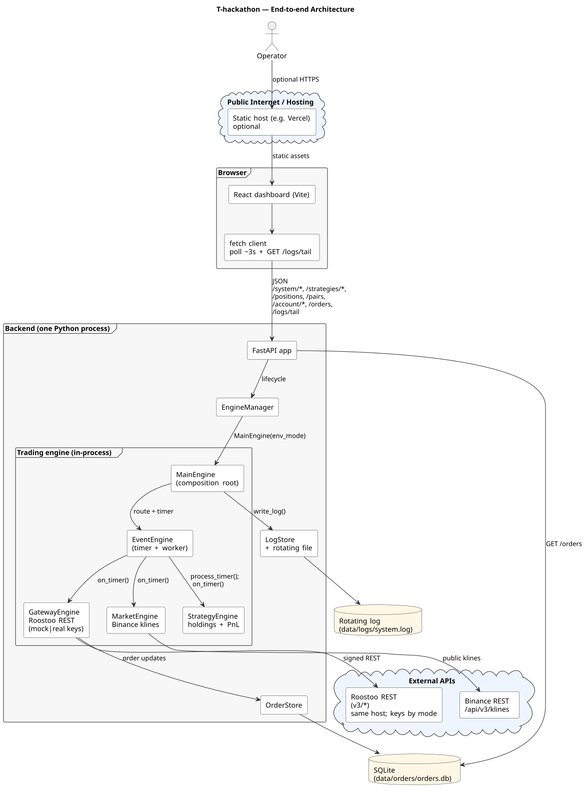

# T-hackathon

**An event-driven automated trading stack** built for the Roostoo ecosystem: a Python engine that runs multiple strategies against live-style APIs, with a **FastAPI control plane** and a **React dashboard** for monitoring positions, account state, and logs in one place.



View full architecture diagram & codebase design at:

  - [Architecture notes](doc/ARCHITECTURE.md)
  - [Codebase design](doc/CODEBASE.md)

---

## What you’re looking at

- **Trading engine** — timer-driven loop: market data (Binance klines), strategy logic, and order execution / account sync via Roostoo’s signed REST API.
- **Strategies** — pluggable modules (e.g. multi-asset momentum rotation, intraday support-bounce logic, plus a small heartbeat strategy for integration tests).
- **Operator UI** — start/stop the engine and individual strategies, view holdings and PnL-style snapshots, tail logs (including streaming), without digging through raw JSON logs.
- **Separation of concerns** — execution and caching live in the gateway; the HTTP layer exposes control and read-only snapshots suitable for a dashboard or remote ops.

This README is meant as a **project showcase for judges**. For step-by-step production or EC2 deployment, see **`README_DEPLOY.md`**. Deeper architecture notes live in **`CODEBASE_ANALYSIS.md`**.

---

## Tech stack (at a glance)

| Layer | Notes |
|--------|--------|
| Engine | Python — event loop, strategy registry, Roostoo gateway, SQLite-backed order history where applicable |
| Control API | FastAPI + Uvicorn |
| Dashboard | React, TypeScript, Vite |
| Exchange | Roostoo v3 (orders / balances); Binance public data for bars |

---

## Setup (for reviewers who want to run it)

**Backend**

```bash
python -m venv .venv
source .venv/bin/activate   # Windows: .venv\Scripts\activate
pip install -r requirements.txt
cp .env.sample .env         # fill keys — see comments inside .env.sample
python api_server.py
```

Default listen: `http://0.0.0.0:8000`. After startup, use the dashboard to start the engine in **mock** or **real** mode and to start strategies by name.

**Frontend**

```bash
cd frontend
npm install
npm run dev
```

Point the app at your API with `VITE_API_BASE` if needed (`frontend/.env.example`).

**Optional:** `./run_backend.sh` recreates a Python 3.12 venv and launches the API (see script header).

---

## Configuration (short)

- Copy **`.env.sample`** → **`.env`** and set Roostoo keys (general testing vs competition, depending on mode).
- **`mock`** vs **`real`** mainly selects which key pair the gateway uses; the public API host is typically the same.
- CORS, port, and environment flags are documented in `.env.sample`; production-style runbooks are in **`README_DEPLOY.md`**.

---

## Repository map

| Path | Role |
|------|------|
| `src/engines/` | Main engine, event loop, market, gateway, strategies |
| `src/strategies/` | Strategy implementations and shared template |
| `src/control/` | FastAPI app, engine lifecycle, log/order helpers |
| `frontend/` | Dashboard |
| `scripts/` | Utilities (background runner, API checks, account helpers) |
| `tests/` | Pytest suite |

Strategy write-ups: **`doc/strategies/`**.

---

## Testing

```bash
pytest -q
```